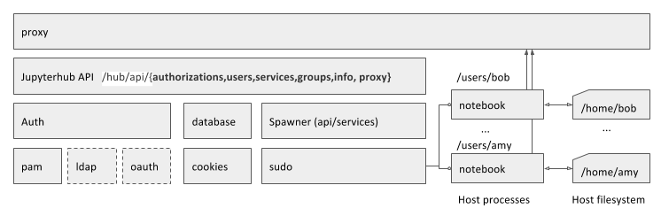
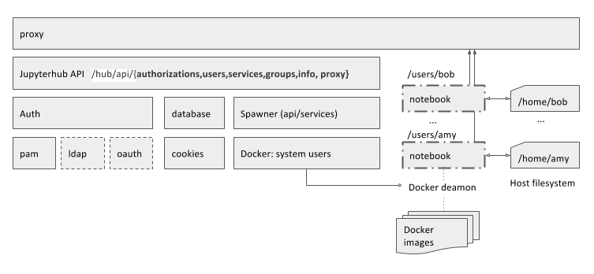

# Datalab

This repository provides a reference deployment of [JupyterHub](https://github.com/jupyter/jupyterhub), a multi-user [Jupyter Notebook](http://jupyter.org/) environment, on a **single host** using either Linux sudo processes or [Docker](https://docs.docker.com).  

This setup provides a single-command way to startup start up a JupyterHub RHEL/CentOS machine. 
The only requirement is needed is [vagrant](https://www.vagrantup.com/). This setup heavily borrows from a number of ideas such as 
the [JupyterHub deploy docker setup](https://github.com/jupyterhub/jupyterhub-deploy-docker).

This repo contributes in two ways:
 
* Provides a way to test a single-node JupyterHub installation on a clean CentOS VM.
 
* Setup JupyterHub using ansible in four different [spawner configurations](https://github.com/jupyter/dockerspawner):

  * [sudo spawner](https://github.com/jupyterhub/sudospawner) (jupyter notebook)
  * [sudo spawner](https://github.com/jupyterhub/sudospawner) (jupyter lab)
  * [docker spawner](https://github.com/jupyterhub/dockerspawner) (jupyter lab, system user)
  * [image spawner](https://github.com/ryanlovett/imagespawner/blob/master/imagespawner.py) (jupyter lab, system user, multiple images)
  
### sudo spawner


### docker spawner


### How to run 

from the repo root dir type: `vagrant up`

### Default provisioning

The default provisioning runs docker image spawner, which allows the logged-in user to select a number of instances.

```
    - role: ansible-role-centos-jupyterhub
      jupyterhub_spawner: 'imagespawner'
      jupyterhub_spawner_docker_image:
        - 'natbusa/sysuser-scipy-lab'
        - 'natbusa/sysuser-datascience-lab'
        - 'natbusa/sysuser-tensorflow-lab'
        - 'natbusa/sysuser-all-spark-lab'
      generate_testusers: True
      gen_test_username:
        - amy
        - joe
        - sue
        - bob
```

for more details about the JupyterHub ansible script, pleas refer to https://github.com/natbusa/ansible-role-centos-jupyterhub

### Debug

On the host - check the system journal:   
`sudo journalctl -u jupyterhub`

when running docker containers:   
`sudo docker logs <container-id`

list running and paused containers:  
`sudo docker ps -a`

